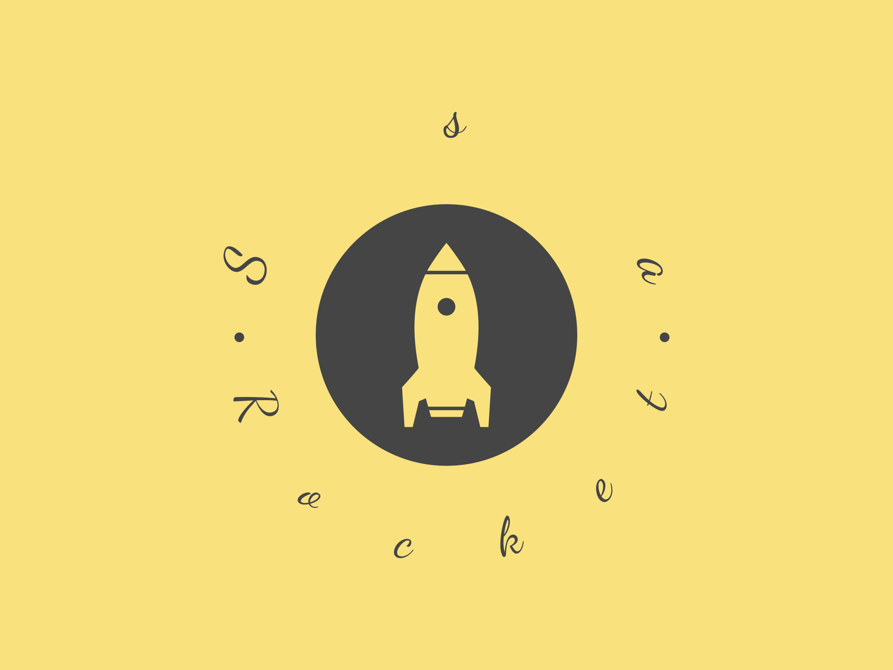

<h4 style="font-style: revert">
This project is a starter with a set of packages/components that helps you work with Lumen 10 and Vue JS 2 (Vuetify), and easy to start a new project gradually expanding
</h4>

Introduction

. Starting
- 
---

- Install VirtualBox in your system
- composer install
- php vendor/bin/homestead make
- vagrant up
- :smirk: Have a good working day

HTTPS on Chrome && Firefox
- 
---
. Chrome
- 

- Settings
- Privacy and Security
- Security
- Manage device certificates
- Authorities
- Import ssl certificate on path your project, ssa/.etc/ssl/ca.homestead.ssa.crt

. Firefox
- 

- Settings
- Privacy & Security
- Certificates
- View Certificates
- Authorities
- Import ssl certificate on path your project, ssa/.etc/ssl/ca.homestead.ssa.crt